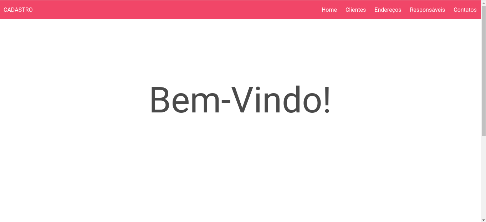
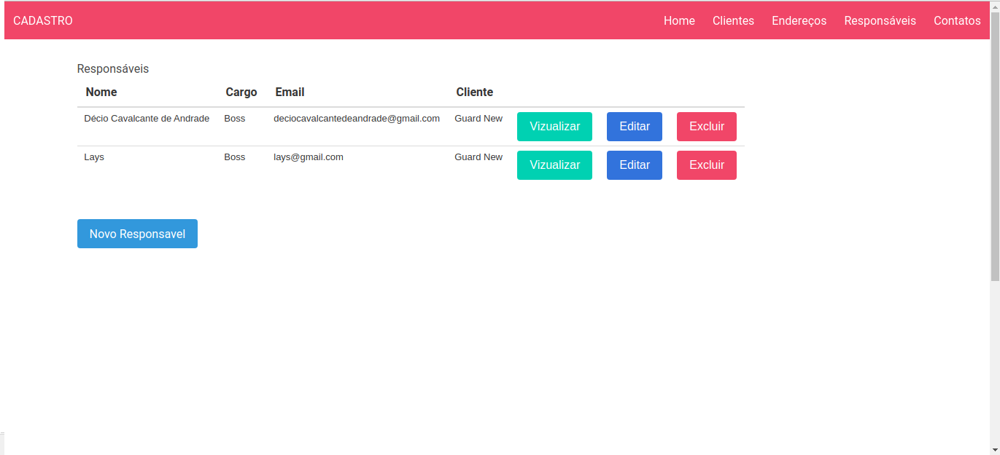

## Sobre o Sistema de Cadastro de Clientes

Este repositório é um projeto feito em resposta à atividade requerida em processo avaliativo, pela empresa GuardCenter.

## Autor: Décio de Andrade

A ideia do projeto é um sistema de cadastro de empresas clientes, endereços, pessoas responsáveis e contatos telefônicos.

## Instalação
Este projeto é feito na versão 2.4.4 do ruby ​​e 5.2.0 do rails.

1. Clone o projeto
2. Configure username e password em`config/database.yml`
3. rails db:create 
4. rails db:migrate
5. rails s

## Página Inicial

## Clientes

## Endereços

## Responsáveis

## Contatos

## Footer

## Instruções para Deploy no Heroku:

Install the Heroku CLI
Download and install the Heroku CLI.

If you haven't already, log in to your Heroku account and follow the prompts to create a new SSH public key.

$ heroku login
Create a new Git repository
Initialize a git repository in a new or existing directory

$ cd my-project/
$ git init
$ heroku git:remote -a cadastro-for-gc
Deploy your application
Commit your code to the repository and deploy it to Heroku using Git.

$ git add .
$ git commit -am "make it better"
$ git push heroku master

Existing Git repository
For existing repositories, simply add the heroku remote

$ heroku git:remote -a cadastro-for-gc

